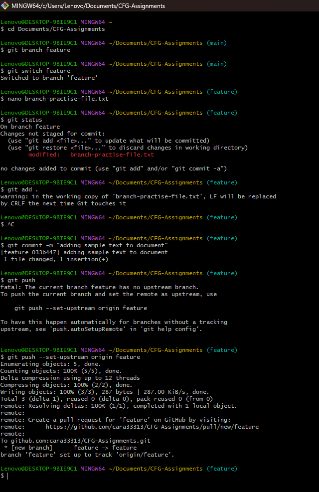
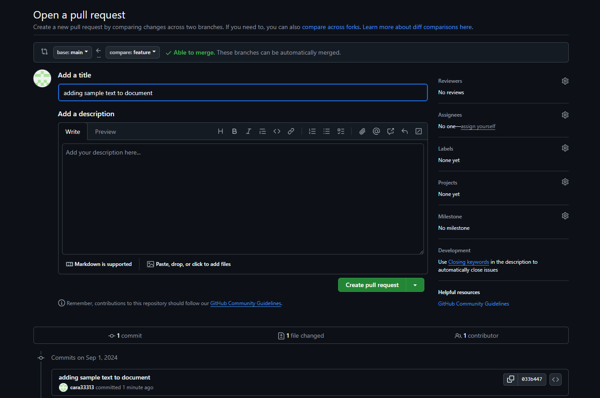
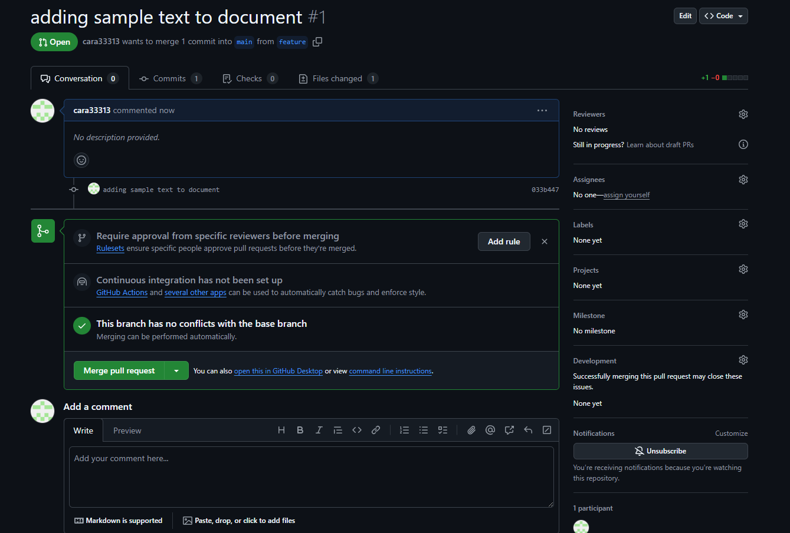

# CFG-Assignments

## Assignment 1

### Editing text file using branches 

>This screenshot shows me:
> - creating and switching to a branch called **feature**
> * adding some text to the document *branch-practise-file.txt*
> + comitting and pushing that change:

> These screenshots show me creating and merging the pull request on **github**:

### .gitignore and requirments.txt

* The .gitignore file can be used to list out things you want to be ignored in commits, like dependencies or files with sensitive information 
- The requirments.txt file is a place to list all packages, libraries and modules a user might need to download to run the git project 
